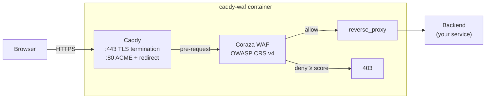

# caddy-waf

Hardened [Caddy](https://caddyserver.com/) Docker image with the [Coraza](https://coraza.io/) WAF and [OWASP Core Rule Set](https://coreruleset.org/) bundled — automatic HTTPS, reverse proxy, and a real WAF in a single container. Configured entirely via environment variables; secrets are never baked into the image.

## Architecture



Caddy handles TLS termination and certificate management (Let's Encrypt by default). Every request is evaluated against the OWASP CRS via the Coraza WAF module before being forwarded upstream — requests whose anomaly score crosses the configured threshold are blocked with `403`.

## Quick Start

```bash
docker run -d \
  -e CADDY_DOMAIN=api.example.com \
  -e CADDY_UPSTREAM=app:3000 \
  -e EMAIL=you@example.com \
  -p 80:80 -p 443:443 \
  ghcr.io/quirkq/caddy-waf:latest
```

That's it. Caddy obtains a Let's Encrypt cert for `api.example.com`, terminates TLS, evaluates each request against OWASP CRS, and reverse-proxies the rest to `app:3000`.

For multi-site setups, mount a full Caddyfile at `/etc/caddy/Caddyfile` or pass it as `CADDYFILE_B64`.

## Environment Variables

### Routing

| Variable | Required | Default | Description |
|---|---|---|---|
| `CADDY_DOMAIN` | Yes¹ | — | Hostname Caddy serves (e.g. `api.example.com`). Accepts wildcards. |
| `CADDY_UPSTREAM` | Yes¹ | — | Reverse-proxy target (`host:port` or `https://host:port/path`) |
| `CADDY_HTTP_PORT` | No | `80` | HTTP listen port |
| `CADDY_HTTPS_PORT` | No | `443` | HTTPS listen port |
| `CADDYFILE_B64` | No | *(unset)* | Base64-encoded full Caddyfile — overrides env-var generation |
| `EMAIL` | No | *(unset)* | ACME account email (Let's Encrypt asks for it) |
| `ACME_CA` | No | *(unset)* | Override ACME endpoint (e.g. `https://acme-staging-v02.api.letsencrypt.org/directory`) |
| `LOG_LEVEL` | No | `INFO` | Caddy log level (`DEBUG`, `INFO`, `WARN`, `ERROR`) |
| `ADMIN_API` | No | *(off)* | Bind address for Caddy's admin API (e.g. `127.0.0.1:2019`) |

¹ Required unless `CADDYFILE_B64` is set or a Caddyfile is mounted at `/etc/caddy/Caddyfile`.

### WAF

| Variable | Default | Description |
|---|---|---|
| `WAF_MODE` | `On` | `On` (block), `DetectionOnly` (log only), `Off` (engine disabled) |
| `WAF_PARANOIA` | `1` | OWASP CRS paranoia level, 1–4. Higher = stricter, more false positives |
| `WAF_ANOMALY_INBOUND` | `5` | Inbound anomaly score that triggers a block (lower = stricter) |
| `WAF_ANOMALY_OUTBOUND` | `4` | Outbound anomaly score threshold |
| `WAF_CUSTOM_RULES_B64` | *(unset)* | Base64-encoded extra ModSecurity-style directives — included after CRS |

### TLS

By default Caddy obtains Let's Encrypt certs automatically. To bring your own (offline, internal, or pinned cert) supply either mounted files or base64 env vars:

| Variable | Default | Description |
|---|---|---|
| `TLS_CERT_FILE` | `/etc/caddy/tls/server.crt` | Path to TLS certificate (PEM) |
| `TLS_KEY_FILE` | `/etc/caddy/tls/server.key` | Path to TLS private key (PEM) |
| `TLS_CERT_B64` | *(unset)* | Base64-encoded certificate (written to `TLS_CERT_FILE`) |
| `TLS_KEY_B64` | *(unset)* | Base64-encoded private key (written to `TLS_KEY_FILE`) |
| `TLS_CA_B64` | *(unset)* | Base64-encoded CA cert (for upstream verification) |
| `TLS_INTERNAL` | `false` | Use Caddy's internal CA (self-signed) for testing |

When `TLS_CERT_FILE` + `TLS_KEY_FILE` exist, ACME is automatically skipped for that domain.

### Container

| Variable | Default | Description |
|---|---|---|
| `PUID` | `1000` | UID for the caddy process |
| `PGID` | `1000` | GID for the caddy process |
| `HEALTH_PORT` | `8080` | HTTP health endpoint port (`0` to disable) |

## How the WAF Works

The image bundles the latest OWASP CRS v4 release at build time. Each request flows through the Coraza filter before reaching `reverse_proxy`:

1. Coraza evaluates the request against the CRS rule chain (`REQUEST-901` … `REQUEST-949`).
2. Rules add to an **anomaly score** when they match. Each rule is weighted (`critical=5`, `error=4`, `warning=3`, `notice=2`).
3. After all rules run, `REQUEST-949-BLOCKING-EVALUATION` compares the score against `tx.inbound_anomaly_score_threshold`. If the score is ≥ threshold, the request is blocked with `403`.
4. Response bodies are evaluated similarly (`RESPONSE-950` … `RESPONSE-959`) — useful for catching reflected XSS, SQL error leaks, etc.

### Paranoia levels

| Level | Behavior |
|---|---|
| **1** | Strict, low false positives — recommended for most APIs |
| **2** | Stricter — catches more, accepts more false positives |
| **3** | Very strict — significant false positives expected, requires tuning |
| **4** | Maximum — heavy false positives, only for highly-locked-down workloads |

Run in `WAF_MODE=DetectionOnly` first to observe what would be blocked, then promote to `On` once tuned.

### Custom rules

To add allowlist exceptions, virtual patches, or app-specific signatures, pass a base64-encoded file of modsec directives:

```bash
cat > extra.conf <<'EOF'
# Allow a known-good payload that CRS flags as SQLi
SecRule REQUEST_URI "@beginsWith /api/legacy/" \
    "id:1000001,phase:1,pass,nolog,ctl:ruleRemoveById=942100"
EOF

docker run -d \
  -e CADDY_DOMAIN=api.example.com \
  -e CADDY_UPSTREAM=app:3000 \
  -e EMAIL=you@example.com \
  -e WAF_CUSTOM_RULES_B64=$(base64 < extra.conf) \
  -p 80:80 -p 443:443 \
  ghcr.io/quirkq/caddy-waf:latest
```

Custom rules are included **after** the CRS, so `ctl:ruleRemoveById` and similar tuning directives work as expected.

## Bring Your Own Caddyfile

For multi-site setups, JSON config, route-specific WAF tuning, or anything the env-var generator can't express, mount a Caddyfile directly:

```bash
docker run -d \
  -v ./Caddyfile:/etc/caddy/Caddyfile:ro \
  -p 80:80 -p 443:443 \
  ghcr.io/quirkq/caddy-waf:latest
```

The image still loads the CRS at `/etc/caddy/crs/` — reference it from your Caddyfile:

```caddyfile
{
    order coraza_waf first
    email you@example.com
}

(waf) {
    coraza_waf {
        directives `
            SecRuleEngine On
            SecRequestBodyAccess On
            Include /etc/caddy/crs/crs-setup.conf
            Include /etc/caddy/crs/rules/*.conf
        `
    }
}

api.example.com {
    import waf
    reverse_proxy api-backend:3000
}

dashboard.example.com {
    import waf
    reverse_proxy dashboard:8080
}
```

For platforms without volume mounts, pass `CADDYFILE_B64=$(base64 < Caddyfile)`.

## Persistent State

Caddy stores ACME account keys, certificates, and OCSP staples in `/data`, and dynamic state in `/config`. For production, mount these as volumes — otherwise certificates are re-issued on every container restart and you'll quickly hit Let's Encrypt rate limits.

```bash
docker run -d \
  -v caddy_data:/data \
  -v caddy_config:/config \
  -e CADDY_DOMAIN=api.example.com \
  -e CADDY_UPSTREAM=app:3000 \
  -e EMAIL=you@example.com \
  -p 80:80 -p 443:443 \
  ghcr.io/quirkq/caddy-waf:latest
```

## Health Check

An HTTP health endpoint runs on port `8080` (configurable via `HEALTH_PORT`):

- **URL:** `http://<container>:8080/cgi-bin/health`
- Returns `200 OK` when Caddy is running, `503` otherwise
- Independent of the main listener, so it works while TLS is initializing

Set `HEALTH_PORT=0` to disable.

## Deploy on Bunny Magic Containers

1. Push the image to GHCR (the GitHub Actions workflow does this automatically on every push to `main`).
2. In the [bunny.net dashboard](https://dash.bunny.net), go to **Magic Containers** and create a new app.
3. Set the container image to `ghcr.io/quirkq/caddy-waf:latest`.
4. Add environment variables: `CADDY_DOMAIN`, `CADDY_UPSTREAM`, `EMAIL`.
5. Add endpoints:
   - Port **443** — HTTPS (public)
   - Port **80** — HTTP (public, for ACME challenges and redirects)
   - Port **8080** — health checks (internal)
6. Set health probes to **HTTP GET** on port **8080** path `/cgi-bin/health`.
7. Attach a persistent volume to `/data` so cert renewals survive restarts.

Note the public IP and point your domain's A record at it.

## Example & Integration Tests

The `example/` directory contains a Docker Compose setup that runs the full stack with DNS and an internal CA:

```
test client → DNS → caddy-waf (TLS + WAF) → nginx backend
```

```bash
cd example
./run.sh            # build image, run tests
./run.sh --no-build # skip build (use existing caddy-waf:test)
```

The script starts all services and runs integration tests:

1. **DNS resolution** — CoreDNS resolves `app.test.internal` to the caddy-waf container
2. **HTTPS reverse proxy** — happy path through Caddy → backend
3. **Health endpoint** — port 8080 returns `200 OK`
4. **SQL injection blocked** — `?id=1' OR '1'='1` returns `403`
5. **XSS blocked** — `?q=<script>alert(1)</script>` returns `403`
6. **Path traversal blocked** — `/../../etc/passwd` returns `403`
7. **DetectionOnly mode** — same payloads pass through but anomaly score is logged
8. **HTTP→HTTPS redirect** — port 80 returns 308 to https

These tests run in CI on every push — the image is only published if they all pass.

## Image Tags

| Tag | Description |
|---|---|
| `latest` | Latest stable Caddy release with the newest coraza-caddy and CRS |
| `2` | Latest 2.x |
| `2.10` | Latest 2.10.x |
| `2.10.0` | Specific Caddy version |

Each tag pins Caddy; the coraza-caddy module and OWASP CRS version are detected and stamped into the image labels at build time.

## Hardening

- Single-purpose image — only Caddy, the Coraza module, and the CRS rules
- Built with [`xcaddy`](https://github.com/caddyserver/xcaddy) — no plugin loading at runtime
- Runs as non-root user (`caddy`) with configurable UID/GID via `PUID`/`PGID`
- Compatible with `--user` / Kubernetes `securityContext` for rootless operation
- Caddy admin API **disabled by default** (`admin off`)
- Generated Caddyfile validated with `caddy validate` before launch
- Generated config file written with `400` permissions
- Env-var inputs validated; domain and upstream strings checked against an allowlist regex
- User-supplied WAF rules written to a separate `Include` file — never injected into the Caddyfile string
- Caddy data volume (`/data`) is the only writable runtime path
- `tini` as PID 1 — reaps zombies and forwards signals cleanly
- Trivy vulnerability scan on every build
- Caddy / Coraza / CRS / Alpine versions auto-detected at build time for latest patches
- Scheduled rebuilds (Sunday + Wednesday) pick up new upstream releases automatically

## License

[Apache 2.0](LICENSE)
